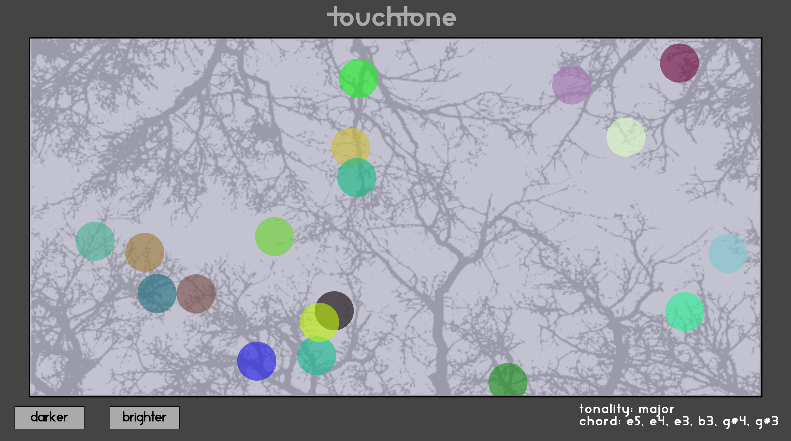

# TouchTone
### A click-forest to generate harmonic landscapes

[Check out TouchTone](http://davespivey.github.io/projects/touchtone/touchtone.html)

TouchTone is an interactive page that produces varying harmonies based on the "mood" set by a user. It uses Web Audio API and its synthesizer components to produce a set of tones from a chosen harmonic group. Clicking on a floating node will select a scale (i.e. major, minor, whole-tone) and play six notes together randomly picked from that scale. As the screen darkens, the possibility grows that a more dissonant chord structure will be selected. At its lightest, only major chords are generated.

The nodes are Scalable Vector Graphics (SVG) animated with the D3.js library.

I plan to build the project out with more variance in the synthesizers, for example, detune or mixed-waveform features depending on window brightness. For now, please click around and enjoy creating your own soundtrack!